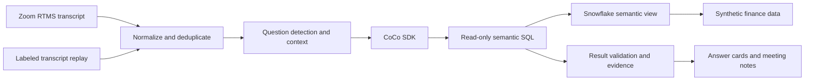

# CoCo Meeting Analyst — PoC task checklist

Revised October 1, 2026. This is the active build specification. It replaces the broader first-pass roadmap. Tasks are ordered by dependency, with no calendar estimates. No application has been built or connected to the user's accounts yet.

**Outcome and scope**

Ship a small, demonstrable meeting analyst: a question spoken in a Zoom meeting produces a correct financial answer from Snowflake, with its interpretation, SQL, and query ID, while the meeting continues. At the end, export notes containing findings and follow-ups. Publish a short demo recording and a reproducible project; a public multi-user service is not a prerequisite.

Default choices: Zoom RTMS with transcription; Cortex Code Agent SDK as the analysis engine; one Snowflake semantic view; synthetic QBR data; TypeScript UI and persistent Node backend; SQLite for meeting state. A replay adapter supports development and demonstrations when a live meeting is inconvenient. Build a microphone/hosted-ASR adapter only if Zoom access blocks the PoC.

**Architecture**

The semantic view owns financial meaning; meeting context supplies the selected quarter, current topic, and follow-up references. CoCo combines those inputs. Do not assume merely creating the view guarantees the SDK will discover or use it. Explicitly give the worker its fully qualified name, permitted metrics/dimensions, and validated examples, and inspect executed SQL.

**T01 — Prove access and the core integration. No dependencies.**

- [ ] Confirm whether the user's account is the standard Snowflake trial or dedicated CoCo CLI trial. The CLI documentation excludes standard trials; resolve this before treating SDK access as available. Do not silently convert an account to paid.
- [ ] Configure a named Snowflake connection without committing secrets. Record cloud/region, runtime identity, and supported model.
- [ ] Install and pin a working Cortex Code CLI / SDK pair; use Node 22+.
- [ ] Run a minimal SDK request and a real read-only SQL query. Capture streamed events, actual tool names, SQL inputs, result rows, and query IDs where available.
- [ ] Test one structured final response and one contextual follow-up.
- [ ] Confirm Zoom Developer Pack availability on the intended test account, RTMS settings, host permission behavior, and transcript scopes. Verify one transcript event from a meeting hosted by the user.
- [ ] Record concrete blockers in `docs/setup.md`; continue fixture-based UI/data work while account setup is pending.

Acceptance: genuine SDK inference and Snowflake execution are demonstrated; Zoom is either demonstrated or explicitly documented as blocked with the fallback selected. No mocked event counts as an integration pass.

**T02 — Scaffold the smallest useful application. Depends on T01 interface findings.**

- [ ] Create one repository with `apps/web`, `server`, `sql`, `data`, `fixtures`, `tests`, and `docs`. Avoid microservices and a general plugin framework.
- [ ] Use a persistent Node backend for SDK processes and RTMS sockets. Use React/Next.js for the meeting page and SQLite for local persistence.
- [ ] Define shared event schemas: transcript segment, question, analysis status, query evidence, answer card, and note.
- [ ] Include meeting ID, event ID, segment revision, question ID/version, and timestamps in relevant events.
- [ ] Add an SSE endpoint for UI updates, question submission endpoint, cancel endpoint, and meeting start/stop/export endpoints.
- [ ] Add `.env.example`, a secrets-safe ignore file, and one documented local start command.

Acceptance: a fixture transcript appears in the UI and produces a mock card clearly labeled as a fixture. The same schemas will accept live events.

**T03 — Generate a focused financial demo. No dependency on Zoom.**

- [ ] Generate a fictional company, Meridian Cloud: 24 closed months through September 2026, 100 synthetic customers, three regions, two customer segments, and two products. Use a fixed seed and dataset version.
- [ ] Create a single denormalized fact table at customer × product × month grain, with region, segment, actual revenue, budget revenue, actual COGS, and budget COGS. This small PoC intentionally avoids complex joins.
- [ ] Give the synthetic budget the same customer-level grain so customer exclusions are valid for both actual and budget. Document that this is a demo planning assumption, not a universal finance data model.
- [ ] Store monetary values as fixed-precision decimals. Use USD and calendar quarters throughout.
- [ ] Plant an EMEA enterprise shortfall and one large customer contraction. Make other regions partially offset the shortfall.
- [ ] Plant a product mix or cost change that affects gross margin. Avoid causal claims beyond what the generated records establish.
- [ ] Build repeatable create/load/reset scripts scoped only to the demo database.
- [ ] Validate grain uniqueness, quarterly totals, customer totals, nonzero planned totals where expected, and no unintended join duplication.
- [ ] Create independent expected results for the three demo questions and at least five paraphrases/follow-ups. Derive answers from data, never from hardcoded response text.

Acceptance: one repeatable command loads the dataset and a validation command reconciles expected numbers. ARR, NRR, FX, opex, and forecasting are outside the first PoC.

**T04 — Create and verify the semantic layer. Depends on T03.**

- [ ] Create `COCO_QBR_DEMO.ANALYTICS.QBR_FINANCE` as a native semantic view over the demo fact table. Check in its YAML or DDL as the authoritative specification.
- [ ] Define dimensions: month, quarter, region, segment, customer, and product. Give each a description and useful synonyms.
- [ ] Define metrics: actual revenue, budget revenue, revenue variance, revenue variance percentage, gross profit, and gross margin. Specify zero-denominator handling.
- [ ] Define variance as actual minus budget, and gross margin as aggregate gross profit divided by aggregate revenue. Keep currency rounding at display time.
- [ ] Document that revenue means recognized revenue, quarters are calendar quarters, amounts are USD, and data ends September 2026.
- [ ] Add validated example questions and SQL for total variance, EMEA enterprise variance contribution, a customer exclusion, and product-level gross margin.
- [ ] Register examples as verified queries for future Cortex Analyst use. Also pass selected validated examples explicitly to the CoCo worker; do not assume Analyst's verified-query machinery applies automatically to direct SDK SQL.
- [ ] Verify direct `SEMANTIC_VIEW(...)` queries in Snowflake, including filtering and aggregation behavior.
- [ ] Generate a compact runtime context file from the semantic specification. Avoid a separately maintained metric catalog with conflicting definitions.
- [ ] Grant the runtime role the exact privileges required for the chosen querying path and prove it cannot write or access unrelated data.

Acceptance: direct semantic queries match independent base-table calculations for every supported demo metric and filter.

Why this belongs in the PoC: semantic views define metrics, dimensions, facts, relationships, descriptions, and synonyms. Snowflake recommends them for new semantic implementations. [Semantic view specification](https://docs.snowflake.com/en/user-guide/views-semantic/semantic-view-yaml-spec)

Semantic views can be queried directly using semantic SQL. This lets the first version keep CoCo as the only reasoning loop. [Querying semantic views](https://docs.snowflake.com/en/user-guide/views-semantic/querying)

Optional escalation if direct CoCo SQL is unreliable: add a Cortex Analyst call scoped to this semantic view, then execute its generated SQL through the controlled execution layer. Analyst generates SQL; do not assume generation alone means execution or correctness. Compare on the same fixtures before adopting the extra model call. [Cortex Analyst API](https://docs.snowflake.com/en/user-guide/snowflake-cortex/cortex-analyst/rest-api)

**T05 — Complete typed question → financial answer. Depends on T02 and T04.**

- [ ] Implement a worker receiving a resolved question, quarter, relevant transcript excerpt, parent question, and semantic view context.
- [ ] Instruct it to query the approved semantic view, use documented metrics, and disclose assumptions. Do not let it explore the entire account for each question.
- [ ] Use the SDK's built-in SQL tool if it exposes adequate control and evidence. If it does not, use one custom execution tool owning the Snowflake connection; keep the CoCo SDK as orchestrator.
- [ ] Enforce restricted Snowflake privileges and deny unnecessary shell/file tools. Validate actual runtime tool names and any available read-only mode against the pinned version.
- [ ] Limit each investigation to three SQL calls, bounded result rows, and an execution timeout. Configure the timeout on the actual SQL session.
- [ ] Capture executed SQL, query ID, returned rows, execution time, and dataset version in backend-owned evidence records. Never trust a model-invented query ID.
- [ ] Return structured answer cards with headline, interpretation, period/filters, assumptions, evidence references, and optional chart data.
- [ ] Validate card values against result rows or deterministic calculations before publishing. Render a table if chart construction fails.
- [ ] Support the follow-up “Exclude the largest customer,” explicitly defining largest by Q3 actual revenue in the current scope unless the speaker says otherwise.
- [ ] Handle ambiguous scope, no data, query errors, and unsupported questions without fabricating an answer.

Acceptance: all supported typed questions reconcile with golden results and have real execution evidence. If an extra Analyst integration is needed, add it here before voice.

**T06 — Connect live Zoom transcripts. Depends on T01; consumes T02 schemas.**

- [ ] Create/configure a Zoom app for local testing with RTMS transcript access and the documented start/stop event subscriptions.
- [ ] Configure a reachable HTTPS webhook endpoint or development tunnel, implement endpoint validation, and verify event signatures.
- [ ] Use Zoom's RTMS sample/SDK flow to establish the authenticated transcript stream. Request only the media needed for the PoC.
- [ ] Map incoming text, participant IDs/names where supplied, timestamps, and stream identifiers to normalized transcript events. Unknown speaker identity is valid.
- [ ] Deduplicate repeated delivery, preserve ordering/revisions where supplied, and handle disconnect/stop events visibly.
- [ ] Implement a clear start/listening/stop state. Stop the RTMS session on meeting end or explicit user stop and verify usage stops.
- [ ] Avoid storing audio/video. Persist only the transcript and analysis required for the demo.
- [ ] Build a JSONL transcript replay adapter with the identical event contract and an obvious Replay label. Replay may execute live Snowflake queries; label that distinction.
- [ ] If RTMS account setup is unavailable, implement only a browser room-microphone plus hosted transcription fallback. Do not simultaneously build Meetily, local Whisper, and Zoom adapters.

Acceptance: a second participant's speech appears in the meeting UI, carries through to an investigation, and stops when capture stops. A Zoom local-test integration is not claimed to be publicly distributable.

**T07 — Trigger relevant investigations and preserve context. Depends on T05 and T06.**

- [ ] Start with an explicit spoken cue such as “CoCo, check…” and an Investigate button on selected transcript text. Keep ordinary QBR conversation flowing in the transcript.
- [ ] Assemble stable utterances and wait briefly for continuation/correction before dispatching. Do not run queries for each partial transcript fragment.
- [ ] Resolve the selected quarter, current topic, region/segment, and parent question. Display that interpretation on the card.
- [ ] Implement one active investigation and a short queue. Continue transcription during SQL execution.
- [ ] Version corrected questions; suppress a stale result if a newer question version exists. Test “Actually, only EMEA.”
- [ ] Preserve ambiguous questions as pending clarifications rather than silently choosing a financial definition.
- [ ] Add a controlled automatic-detection toggle only after the explicit flow works. Extract supported data questions from short transcript windows; ignore commentary and repeated questions.

Acceptance: one spoken question and one contextual follow-up work end to end. Broad passive listening accuracy is a follow-up improvement, not a release blocker for the explicitly invoked PoC.

**T08 — Build the demo-facing meeting page and notes. Depends on T02; integrates T05–T07.**

- [ ] Build one page with live/replay status, current quarter/topic, transcript, investigation status, and answer cards.
- [ ] Give each card a concise answer and expandable assumptions, SQL, query ID, and source data. Use one simple bar chart type plus tables.
- [ ] Add three prepared QBR panels: revenue versus budget, EMEA enterprise contribution, and gross margin by product. Generate all figures from the same dataset.
- [ ] Support follow-up entry, dismiss, pin-to-notes, and cancel.
- [ ] At meeting end, generate an editable recap: discussion, analytical findings with evidence links, decisions, action items, and unanswered questions.
- [ ] Distinguish speaker claims from verified financial findings. Leave unspecified action owners and deadlines blank.
- [ ] Export Markdown or a self-contained HTML recap and support deleting local meeting artifacts.

Acceptance: a viewer can understand the answer immediately and inspect its evidence without leaving the page. Notes can be shared independently of the live backend.

**T09 — Verify the minimum release bar. Depends on the integrated flow.**

- [ ] Run the three demo questions and at least five paraphrases/follow-ups against independent expected results; require all supported results to match.
- [ ] Test wrong-period ambiguity, division by zero, no matching records, duplicate transcript delivery, a correction, and a stale result completing after cancellation.
- [ ] Test an instruction in the transcript asking the agent to write data or switch roles; verify no privileged action occurs.
- [ ] Test failed Snowflake authentication, a query timeout, and RTMS disconnect; show clear recoverable states.
- [ ] Measure end-of-question to validated-answer latency. Report actual measurements; aim for simple answers within roughly 15 seconds on a warmed demo, without presenting that as a vendor guarantee.
- [ ] Record RTMS streaming minutes, Snowflake query count, and available inference usage. Keep replay/fixture results separate from live results.
- [ ] Run one full live rehearsal and one replay rehearsal. Verify transcript ingestion remains responsive while analysis runs.

Acceptance: the scripted flow is correct, evidence-backed, and repeatable; failures are visible. A broad benchmark platform is not required for this PoC.

**T10 — Package and release the PoC. Depends on T09.**

- [ ] Record a short walkthrough: revenue miss → EMEA enterprise breakdown → largest-customer exclusion → evidence → recap.
- [ ] Prepare a README with the problem, architecture, prerequisites, exact setup commands, sample questions, known limitations, and demo link.
- [ ] Include seeded data, semantic-view definition, expected results, replay transcript, and a sample synthetic recap in the repository.
- [ ] Add a suitable project license and retain dependency notices; check tracked files for secrets and non-synthetic meeting content before publication.
- [ ] Prepare the repository for public release and a concise announcement draft. Publish only to the destination/account the user designates; do not send social posts automatically.
- [ ] If a clickable public demo is desired, first ship a static recorded/replay experience or protect the live backend with authentication and a request cap. Keep credentials server-side.
- [ ] Separate publicly sharing a recording/source code from distributing a Zoom app to outside accounts. Review Zoom's distribution requirements before external installations; do not make marketplace release a prerequisite for the first demo recording.

Acceptance: someone can watch the demo, understand the use case, and reproduce it from the documented setup. Public live multi-tenancy is future work.

**Zoom cost reference — checked October 1, 2026**

The official Zoom Developer Pack “View credit rates” dialog lists RTMS with transcription at **$0.02 per session streaming minute** and without transcription at **$0.01**. Its notes define metering by active streaming sessions, beginning when the media WebSocket is established. This is the RTMS meeting integration rate, not a Video SDK participant-minute rate. [Zoom Developer pricing](https://zoom.us/pricing/developer)

For one active RTMS session at the published transcription rate: 30 minutes costs $0.60; 60 minutes costs $1.20; ten one-hour demos cost $12; 100 meeting hours cost $120. Multiple separately created sessions add usage. Estimates exclude taxes, any Zoom meeting plan, hosting, and Snowflake warehouse/inference charges.

The public page currently offers pay-as-you-go with $0 upfront and advertises 20 trial credits. Confirm account eligibility and applicable checkout terms; the estimate does not assume free credits. The RTMS guide still requires Developer Pack access with sufficient credits. [RTMS setup](https://developers.zoom.us/docs/rtms/meetings/getting-started/)

**Build-agent operating instructions**

Follow T01–T10 in dependency order, keep checkboxes current, and record decisions and blockers in `docs/build-log.md`. UI fixtures and data preparation may proceed independently of account access. Do not mark a live integration done based on mocked output. Prefer the smallest implementation passing each acceptance gate. Stop expanding scope once the demonstrated release bar is met.

Preserve the SDK as the requested core integration. A native semantic view is required. Cortex Analyst is a conditional enhancement if direct semantic SQL fails the question fixtures. Cortex Search, an additional managed Cortex Agent, managed MCP infrastructure, a forked notetaker, slide OCR, calendar bots, ARR/NRR, and enterprise tenancy are deferred. These are useful later only when a demonstrated need justifies them.

Source for SDK setup and capabilities: [Cortex Code Agent SDK](https://docs.snowflake.com/en/user-guide/cortex-code-agent-sdk/cortex-code-agent-sdk). Account access constraint: [CoCo CLI](https://docs.snowflake.com/en/user-guide/cortex-code/cortex-code-cli).
